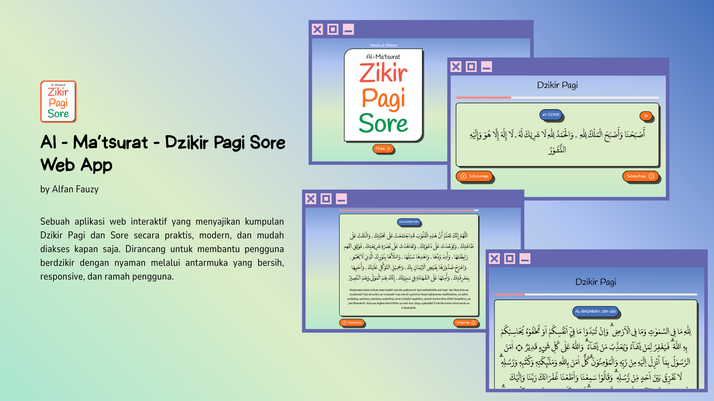

# Al-Ma’tsurat – Dzikir Pagi & Sore 🌅🌙

A simple, lightweight, and ad-free web app to help Muslims recite daily _dzikir_ (remembrances) in the morning and evening.  
Built for focus, speed, and a clean user experience — with PWA support so you can use it offline like a native app.

## 🔗 **Live Demo**: [https://dzikir-almatsurat.netlify.app/](https://dzikir.alfan.web.id)

## 🕌 Features

-   ⏰ **Auto detect Morning or Evening dzikir** based on your local time
-   👉 **Interactive step-by-step navigation**
-   📊 **Progress bar** to track reading
-   ⌨️ **Keyboard navigation** with arrow keys
-   📱 **Offline support (PWA)** – installable to your device
-   ⚡ **Fast, minimal, and mobile-first UI**
-   🚫 **Ad-free experience**

## 💻 Tech Stack

-   `HTML`, `CSS`, `JavaScript` (Vanilla)
-   `Service Worker` (for PWA support)
-   `Lucide Icons` – modern and lightweight icon set
-   `JSON` – used for dynamic dzikir content
-   `Mobile-first` responsive layout

## 🧠 Motivation
I built this because most dzikir apps are either too heavy, full of ads, or have poor UX.
This project aims to provide a better experience: minimal, responsive, and spiritually focused ✨

## 🙌 Contributing
Contributions are welcome!
If you want to help improve the UI/UX, translations, or add features, feel free to open a pull request.

## 📄 License
This project is licensed under the MIT License.

## 🤲 Support
If you find this app useful or spiritually beneficial, feel free to share it with others or give the repo a ⭐
